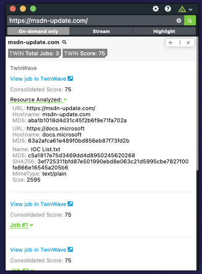

# Polarity TwinWave Integration

TwinWave is a threat analysis platform that seamlessly integrates best of breed open source projects, third party commercial solutions and their own technology in a purpose built application that fully automates the steps an experienced security analyst or researcher would follow to analyze a suspected threat.

The TwinWave Polarity Integration searches the TwinWave API for Attack Chain data for Domains, URLs, IPs, SHA256 Hashes and MD5 Hashes for phishing related activity and a Score Assessment.

To learn more about TwinWave, please visit https://www.twinwave.io/

## TwinWave Integration Options

### TwinWave API Url

API Url for TwinWave allows searching indicators via the TwinWave API

### API Key

API Key provided by TwinWave allows access to make searches using the TwinWave API.

### Max Concurrent Search Requests

Maximum number of concurrent search requests (defaults to 20). Integration must be restarted after changing this option.

### Minimum Time Between Searches

Minimum amount of time in milliseconds between each entity search (defaults to 100). Integration must be restarted after changing this option.

## Installation Instructions

Installation instructions for integrations are provided on the [PolarityIO GitHub Page](https://polarityio.github.io/).

## Polarity

Polarity is a memory-augmentation platform that improves and accelerates analyst decision making. For more information about the Polarity platform please see:

https://polarity.io/
